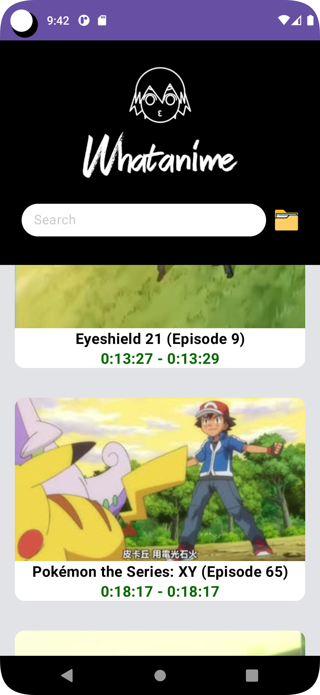

# Whatanime App

Whatanime is a mobile application for search a anime scene from input image or image url. This application use Trace.moe API & Jetpack Compose.

Hopefully Whatanime can help you to know what your curiousity about an anime stills.
## Acknowledgements

- [trace.moe API](https://soruly.github.io/trace.moe-api/)

## Tech Stack

**Language:** Kotlin

**Toolkit:** Jetpack Compose

**VideoPlayer:** ExoPlayer

**HTTP Client:** Retrofit

**Manajemen Versi**: Git

## Screenshots

